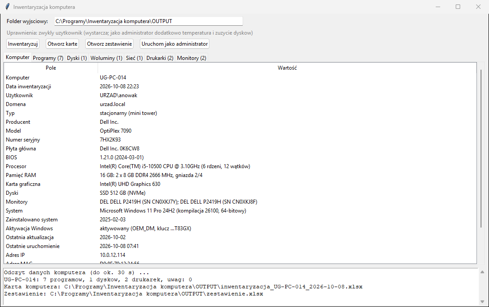

# Inwentaryzacja komputera

Program dla administratora IT. W kilkanaście sekund spisuje **jeden komputer
z Windows**: sprzęt z numerami seryjnymi, dyski i ich stan, Windows i jego
aktywację, sieć, drukarki oraz zainstalowane programy. Tworzy:

- **kartę komputera** (Excel, osobny arkusz na każdą kategorię) do ewidencji
  sprzętu lub protokołu przekazania stanowiska,
- **zbiorcze zestawienie Excela**: arkusz *Komputery*, w którym każdy komputer
  to jeden wiersz, i arkusz *Programy* z programami wszystkich komputerów.
  Po obejściu biura z pendrive'em masz w nim cały park komputerowy, a filtrem
  w Excelu sprawdzisz, na ilu komputerach jest dany program (licencje).

Program **tylko odczytuje** dane. Niczego nie zmienia i nie instaluje.
Działa **bez uprawnień administratora**.



*(na zrzucie dane fikcyjne)*

## Szybki start

1. Zainstaluj [Pythona](https://www.python.org/downloads/windows/) (zaznacz **„Add python.exe to PATH”**).
2. Pobierz `Inwentaryzacja-komputera-<wersja>.zip` z [najnowszego wydania](https://github.com/DawidBochno/Inwentaryzacja-komputera/releases/latest)
   (albo **Code → Download ZIP**) i rozpakuj, np. do `C:\Programy\`.
3. Uruchom **`install.bat`** (raz). Na końcu musi pojawić się „selftest OK”.
4. Uruchom **`uruchom.bat`** i kliknij **Inwentaryzuj**.

## Co spisuje

| Arkusz | Zawartość |
|--------|-----------|
| **Komputer** | nazwa, domena, zalogowany użytkownik, typ (stacjonarny / laptop / all-in-one / serwer), producent, model, **numer seryjny**, płyta główna, BIOS, procesor, **pamięć RAM** (kości, typ DDR, zajęte gniazda), karta graficzna, dyski, monitory, Windows (wersja, kompilacja, data instalacji), **aktywacja Windows** (stan, kanał licencji OEM/Retail/Volume, ostatnie 5 znaków klucza), **ostatnia aktualizacja**, ostatnie uruchomienie, adres IP i MAC, liczba drukarek i programów, **uwagi** |
| **Programy** | nazwa, wersja, wydawca, data instalacji |
| **Dyski** | model, SSD/HDD, magistrala (NVMe/SATA/USB), rozmiar, numer seryjny, **stan SMART**; jako administrator także temperatura, zużycie SSD w % i godziny pracy |
| **Woluminy** | litera, etykieta, system plików, rozmiar, wolne miejsce |
| **Sieć** | karta, MAC, adresy IP, brama, DNS, DHCP |
| **Drukarki** | nazwa, sterownik, port (np. adres IP drukarki), domyślna, sieciowa |
| **Monitory** | producent, model, **numer seryjny**, rok produkcji |

**Uwagi** (na czerwono w zestawieniu) pojawiają się, gdy: Windows nie jest
aktywowany, dysk ma stan SMART inny niż dobry, na woluminie jest mniej niż
10% wolnego miejsca albo ostatnia aktualizacja Windows była ponad 35 dni temu.
Pełną kontrolę bezpieczeństwa robi program
[Kontrola stanowiska](https://github.com/DawidBochno/Kontrola-stanowiska).

## Karta i zestawienie

- **`OUTPUT\inwentaryzacja_<KOMPUTER>_<data>.xlsx`** otwiera przycisk **Otworz karte**.
- **`OUTPUT\zestawienie.xlsx`** otwiera przycisk **Otworz zestawienie**.
  Ponowna inwentaryzacja tego samego komputera **zastępuje** jego wiersz
  i jego programy.

### Inwentaryzacja wielu komputerów

**Z pendrive'a:** skopiuj folder programu na pendrive (Python musi być na
każdym komputerze), uruchom na każdym stanowisku i kliknij **Inwentaryzuj**.
Wszystkie wyniki trafią do jednego `zestawienie.xlsx` na pendrivie.

**Bez okna** (np. zadanie harmonogramu albo skrypt logowania):

```bat
pyw -3 inwentaryzacja.py --bez-okna \\serwer\IT\inwentaryzacja
```

Jeśli w tej samej chwili zestawienie zapisuje inny komputer albo plik jest
otwarty w Excelu, wiersz nie zostanie dopisany. Karta komputera zapisze się
mimo to, a w logu będzie komunikat.

## Uprawnienia administratora

Nie są potrzebne. Przycisk **Uruchom jako administrator** uruchamia program
ponownie z uprawnieniami. Wtedy w arkuszu *Dyski* są dodatkowo temperatura,
zużycie SSD i godziny pracy (liczniki SMART, `Get-StorageReliabilityCounter`).
Zalogowany użytkownik i programy instalowane „tylko dla mnie” dotyczą konta,
które uruchomiło program.

## Instalacja (jednorazowo)

1. **Python**: pobierz z [python.org](https://www.python.org/downloads/windows/)
   (wersja 3.9 lub nowsza). W instalatorze zaznacz **„Add python.exe to PATH”**.
   Opcja „tcl/tk and IDLE” jest zaznaczona domyślnie i musi taka zostać.
2. **Program**: z [najnowszego wydania](https://github.com/DawidBochno/Inwentaryzacja-komputera/releases/latest)
   pobierz ZIP i rozpakuj. Nie uruchamiaj programu z wnętrza ZIP-a.
3. Kliknij dwukrotnie **`install.bat`**. Instaluje bibliotekę `openpyxl`
   (potrzebny internet) i uruchamia test, który odczytuje też dane tego
   komputera. Na końcu pojawia się **„selftest OK”**.
4. Program uruchamia się plikiem **`uruchom.bat`**.

Wymagania: Windows 10/11 lub Windows Server 2016+ (PowerShell 5.1 jest
w systemie), Python 3.9+.

## Czy program zostanie zablokowany przez antywirusa?

Zwykle nie. Uruchamia PowerShell z poleceniami **tylko do odczytu**
(`Get-CimInstance`, `Get-PhysicalDisk`, rejestr). Skrypt jest przekazywany
jako `-EncodedCommand`, co niektóre systemy EDR oznaczają jako podejrzane.
Jeśli taki alert się pojawi, kod skryptu jest jawny w `inwentaryzacja.py`
(`SKRYPT_PS`) i można go pokazać zespołowi bezpieczeństwa.

## Prywatność

Karta zawiera nazwę komputera, nazwę konta i adresy sieciowe. Traktuj ją jak
dokument wewnętrzny. Folder `OUTPUT` nie trafia do repozytorium. Program nie
wysyła danych poza Twój komputer. Pełny klucz produktu Windows **nie jest**
odczytywany, tylko jego ostatnie 5 znaków.

## Aktualizacje

Po uruchomieniu program sprawdza w tle na GitHubie, czy jest nowa wersja.
Jeśli jest, pyta **„Pobrać i zainstalować teraz?”**. `OUTPUT` nie jest
nadpisywany. Do GitHuba trafia tylko zapytanie o listę plików.
**Wyłączenie:** pusty plik `NIE_AKTUALIZUJ` w folderze programu.

## Ograniczenia

- Spisuje **komputer, na którym jest uruchomiony**. Zdalna inwentaryzacja
  wielu komputerów z jednego miejsca jest na liście pomysłów.
- Programy pochodzą z listy „Aplikacje i funkcje” (rejestr). Aplikacje ze
  Sklepu Microsoft (MSIX) i programy przenośne nie są widoczne.
- Komputery składane często mają w BIOS-ie numer seryjny „Default string”
  albo „To be filled by O.E.M.” — program pokazuje to, co zapisał producent.
- Monitory: numer seryjny pochodzi z EDID monitora. Przez stację dokującą
  lub przejściówkę bywa pusty.
- Stan SMART to ocena systemu Windows (dobry / ostrzeżenie / zły), a nie
  pełna analiza atrybutów jak w CrystalDiskInfo.

## Testy

```bash
python inwentaryzacja.py --selftest
```

Test sprawdza opis na dwóch fikcyjnych komputerach (sprawnym i z uwagami:
nieaktywowany Windows, dysk z ostrzeżeniem SMART, brak miejsca, brak
aktualizacji), kartę XLSX i zestawienie (zastąpienie wierszy, zgodność
kolumn ze starszym plikiem). Na końcu **odczytuje prawdziwe dane komputera**,
na którym działa. Na GitHubie jest to czysty Windows Server, więc każda
zmiana skryptu PowerShell jest sprawdzana na prawdziwym systemie.
